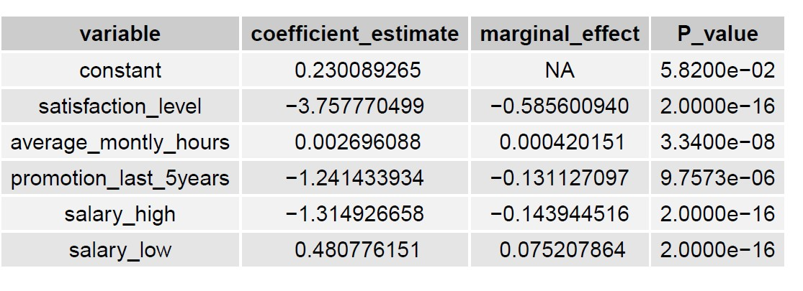
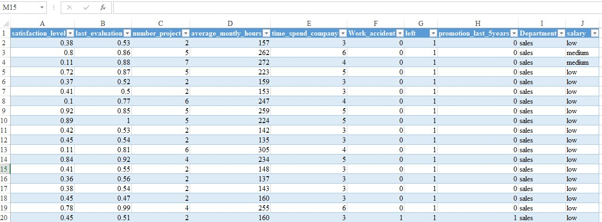

## Introduction

* As noted in the [README](https://github.com/mwangi-george/HR-Data-Analytics-Project/blob/main/README.md), my main focus in this markdown is to conduct Exploratory Data Analysis (EDA) and build a model that predicts employee retention.

## Loading important packages.

* For consistency of functions and productivity, I prefer working with the whole `tidyverse package`. 
```{r}
# loading important packages. 
pacman::p_load(tidyverse, mfx, InformationValue, car, caret)
```

## Loading dataset from working directory

* The dataset is in the comma separated values format.  
```{r}
# Read data from working directory and stores it as hr_data in R
hr_data <- read_csv("datasets/HR_comma_sep.csv", 
                    show_col_types = F) 
```

## Understanding the dataframe.

* Before jumping into the actual tasks, it is important that I understand the data I am working with
```{r}
# Print the structure of the dataframe
glimpse(hr_data)
```

### Data manipulation

1. From the above output, some variables that should be categorical variables are stored as doubles (numerics). This calls for some cleaning to avoid misleading results.
```{r}
# convert the variables work_accident, left, promotion_last_5years, Department, and salary into factors.
hr_data <- hr_data %>% 
  mutate(Work_accident = as.factor(Work_accident),
         left = as.factor(left),
         promotion_last_5years = as.factor(promotion_last_5years),
         Department = as.factor(Department),
         salary = as.factor(salary)) 
# print new variables and their class
sapply(hr_data, class)
```

2. It is also clear from the `glimpse(hr_data)` output that there is an inconsistent naming of variables; Work_accident and Department start with upper case while others do not. To enhance productivity in later stages, I will convert them to lower case. 
```{r}
# print variable names 
names(hr_data)

# rename all variables to lower case
hr_data <- hr_data %>% 
  rename_all(tolower)
```

3. It is important to check for any missing data in the dataframe to avoid inconsistent results.
```{r}
# check for rows with NAs 
hr_data[!complete.cases(hr_data),]
# No missing data
```

4. Before moving to analysis, the `left` variable is a factor containing two levels, 0 if the employee continue to stay at the company and 1 if they left. For easier workflow, I will change these levels into `no` and `yes`. 

```{r}
hr_data <- hr_data %>% 
  mutate(left = if_else(left == 0, "no", "yes")) %>% 
  mutate(left = as.factor(left))

# read the first 3 rows of the dataframe
hr_data %>% 
  head(3)

# unique observations in the left variable
unique(hr_data$left)
```

## Exploratory data analysis

* In this section, the objective is to find out which variables have a direct and clear impact on employee retention. To accomplish this, I will group the employees into two; those who left `yes` and those who stayed `no`. For the numeric variables, I will calculate the mean for each of the groups. These means can be useful metrics to explain employee retention.

```{r}
# summarize the data using the variable left based on mean (EDA)
hr_data %>% 
  group_by(left) %>% 
  summarise(mean_satisfaction_level = mean(satisfaction_level),
            mean_last_evaluation = mean(last_evaluation),
            mean_number_project = mean(number_project),
            mean_average_monthly_hours = mean(average_montly_hours),
            mean_time_spend_company = mean(time_spend_company))
```

### Findings 
* **Part 1 - Numeric Variables**

1. There exists a big difference in the `mean_satisfaction_level` between employees who left and those who stayed. Employees who left had a lower satisfaction level compared to those who stayed by 0.2267116 `(0.6668096-0.4400980)`. This could explain why they left but further statistical analysis is necessary to test whether the difference observed is statistically significant. 

2. There is no clear impact of the variable `last_evaluation` on employee retention since the means for both groups are nearly equal.

3. The same case applies to `mean_number_project`. The difference is very small but statistical analysis is vital to test if it is indeed statistically significant. 

4. The difference in the `mean_average_monthly_hours` between employees who left and those who stayed is quite big. On average, those who left appear to have been working more more than those who stayed by 8.359 hours. 

5. For the categorical variables i.e (`work_accident`, `department`, and `salary`), I will have to take another approach to understand their impact on employee retention. 

* **Part 2 - Categorical Variables**

1. **Impact of employee salary on retention**

* Since I am dealing with two categorical variables, the best way to understand their relationship is through a visualization. First, I will create a table that summarizes the salary categories by whether one left or stayed. 
```{r}
# count the number of employees in each salary category and group by the left variable
hr_data %>% 
  dplyr::select(left, salary) %>% 
  group_by(left) %>% 
  table()

# bar chart showing impact of employees salaries on retention
ggplot(data = hr_data)+
  geom_bar(aes(x = salary, fill = left), position = "dodge", alpha = 0.8)+
  labs(title = "Employee Retention by Salary Category", y = "Count")+
  theme_classic()
```

* From the above graph, most of the employees who left the company were in the low salary category, followed by medium then high. I notice that these results are consistent with theory. 

2. **Correlation between Employee Department and Retention**
```{r}
# count the number of employees in each department category and group by the left variable
hr_data %>% 
  dplyr::select(department, left) %>% 
  group_by(left) %>% 
  table()

# Achieving the same using base R xtabs function
xtabs(~department+ left, hr_data)

## bar chart showing correlation between Employee Department and Retention
hr_data %>% 
  ggplot(aes(department, fill = left))+
  geom_bar(position = "dodge", alpha = 0.8)+
  theme_classic()+
  theme(axis.text.x = element_text(angle = 90))+
  labs(title = "Employee Retention by Department")
```

* From the above chart, most of the employees who left the firm were in the sales department, followed by the technical department and then support department as the top 3.

3. **Correlation between `promotion_last_5years` and employee retention**
```{r}
#Modify the variable promotion_last_5years into "promoted" and "not promoted" for easy understanding of the visualization
hr_data <- hr_data %>% 
  mutate(promotion_last_5years = if_else(promotion_last_5years == 1, "promoted", "not promoted"))
# print the first 3 rows 
head(hr_data, 3)

# count the number of employee in each promotion category and group by whether they left or not
xtabs(~ promotion_last_5years + left, data = hr_data)

# visualizing the above table
hr_data %>% 
  ggplot(aes(promotion_last_5years, fill = left))+
  geom_bar(position = "dodge", alpha = 0.8)+
  theme_classic()+
  labs(title = "Employe Retention by Promotion last 5 years")
```

* From the above table and bar chart, not receiving a promotion has a high impact on retention. Out of a total of 3571 employees who left the company, 3552(about 99 percent) did not receive a promotion in the last five years. This produces the idea that the variable `promotion_last_5years` has a direct on employee retention.

* Based on this exploratory analysis, it is safe to say that the variables `satisfaction_level`, `average_monthly_hours`, `promotion_last_5years`, and `salary` have a direct impact on employee retention. Using these variables, I will proceed to building a logistic regression model to predict employee retention. 
 
## Logistic Regression

### Introduction

* Logistic regression utilizes the method of maximum likelihood estimation to identify an equation of the form *log[p(X)/(1-p(x))] = pr(D = 1) = B0 +B1X1 +B2X2 + ... + BnXn + u*.

* The right hand side of the equation predicts the logit (log odds) of the dependent variable taking the value 1. In my case, I am predicting the probability of leaving (1) using the variables `satisfaction_level`, `average_monthly_hours`, `promotion_last_5years`, and `salary`. 

* Forming an equation to represent this 

* *`left = B0 + B1 x satisfaction_level + B2 x average_monthly_hours + B3 x promotion_last_5years + B4 x salary*

* **Selecting necessary variables and assigning the data to model_data**
```{r}
# select variables for use in modeling 
model_data <- hr_data %>% 
  dplyr::select(left, satisfaction_level, average_montly_hours, promotion_last_5years, salary)

# print first six rows
head(model_data)

# view the structure of new dataset 
str(model_data)
# manipulating the variables promotion_last_5years and left into 1's and 0's
model_data <- model_data %>% 
  mutate(promotion_last_5years = if_else(promotion_last_5years == "promoted", 1,0)) %>% 
  mutate(left = if_else(left == "yes", 1,0))

# print first six rows
head(model_data)

# check variable types
sapply(model_data, class)

# convert the variables promotion_last_5years and left into factors
model_data <- model_data %>% 
  mutate(left = as.factor(left)) %>% 
  mutate(promotion_last_5years = as.factor(promotion_last_5years))

# print first six rows
head(model_data)

# check variable types
sapply(model_data, class)

# check correct data types 
str(model_data)
```

* **Creating dummies for the variable salary**

```{r}
# loading fastDummies package for efficient dummy variable creation
library(fastDummies)

# Create dummies using the fastDummies package
model_data <- dummy_cols(model_data, select_columns = "salary")
head(model_data)

# modify the created dummies into factors 
model_data <- model_data %>% 
  mutate(salary_high = as.factor(salary_high),
         salary_low = as.factor(salary_low),
         salary_medium = as.factor(salary_medium)) 

# print first six rows
head(model_data)
```

* **Drop the column salary**
```{r}
# deselect the column salary
model_data <- model_data %>% 
  dplyr::select(-salary)

# Check for correct data types 
str(model_data)
```

### Creating training and test samples

* This step involves splitting the dataset into a training set to train the model on and a testing set to test the model on.
```{r}
# To make my results reproducible
set.seed(1)

# Utilize 70 percent of the dataset as training set, and the remaining 30 percent as testing set.
sample <- sample(c(T, F), nrow(model_data), replace = T, prob = c(0.7, 0.3))

# assign train set to train
train <- model_data[sample, ]

#assign test set to test
test <- model_data[!sample, ]
```

### Training the model
```{r}
# fitting the logistic regression model. I omit one dummy variable (salary_medium) to avoid the dummy variable trap
logistic_model <- glm(left ~ satisfaction_level + average_montly_hours + promotion_last_5years + salary_high + salary_low, data = train, family = "binomial")

# Disable the scientific notation for model summary
options(scipen = 999)

# call model summary
summary(logistic_model)
```

### Calculating marginal effects
```{r}
# loading the mfx package to calculate marginal effects
library(mfx)

# Calculate coefficient marginal effects 
marginals <- logitmfx(logistic_model, data = train)

# print marginals 
marginals
```

### Simplified table of the results
```{r}
# combining results from the two outputs 
results <- data.frame(variable = c("constant", "satisfaction_level", "average_montly_hours", "promotion_last_5years", "salary_high", "salary_low"),
                      coefficient_estimate = c( 0.230089265, -3.757770499, 0.002696088, -1.241433934, -1.314926658,  0.480776151),
                      marginal_effect = c(NA, -0.585600940, 0.000420151, -0.131127097,  -0.143944516,  0.075207864),
                      P_value = c(0.0582, 0.0000000000000002, 0.0000000334, 0.0000097573, 0.0000000000000002, 0.0000000000000002))

# print results
tibble(results)
```

### Results Interpretation

* A coefficient in a logit model tells us the change in the log of the odds ratio per unit change in the independent variable concerned from its mean.

* Marginal effect of an independent variable gives us the change in the expected value of (Di) caused by a one unit increase in X1i holding constant the other independent variables in the equation.

**We can therefore interpret the above logit model as follows:**

1. Holding all other factors constant, every unit increase in an employee's satisfaction level decreases the log of the odds ratio (logit) of leaving the company by 3.757770499. Additionally, a unit increase in satisfaction level reduces the probability of an employee leaving the company by 0.585600940 (58.56%), holding other factors constant. `satisfaction_level` is statistically significant at 5% level of significance, therefore, a good predictor of employee retention.

2. Holding all other factors constant, every unit increase in an employee's average monthly hours increases the log of the odds ratio of leaving the company by 0.002696088. Also every unit increase of an employee's average monthly hours increases the probability of leaving the company by 0.000420151 (0.042%), holding other factors constant. `average_monthly_hours` is statistically significant at 5% level of significance,  therefore, a good predictor of employee retention.

3. Holding all other factors constant, employees who have received a promotion in the last 5 years have a lower logit of leaving the company by 1.241433934. Additionally, their probability of leaving the company reduces by 0.131127097 (13.11%), ceteris paribus. `promotion_last_5years` is statistically significant at 5% level of significance,  therefore, a good predictor of employee retention.

4. Holding all other factors constant, employees who receive a high salary have a lower logit of leaving the company by 1.314926658, their probability of leaving the company reduces by 0.143944516 (14.39%). `salary_high` is statistically significant at 5% level of significance,  therefore, a good predictor of employee retention.

5. Holding all other factors constant, employees who receive a low salary have a higher logit of leaving the company by 0.480776151, their probability of leaving the company increases by	0.075207864 (7.52%). `salary_low` is statistically significant at 5% level of significance,  therefore, a good predictor of employee retention.


### Assessing Model Fit/Goodness of Fit
* R2 is a metric that we use to measure the goodness of fit of a model in a typical regression.
However, in Logistic Regression, there is no such R2 value. As an alternative, we calculate the McFadden's R2, which has a range of 0 to just below 1. Values that are very close to 0 show that the model has no forecasting ability. Values over 0.40 often signify that a model fits the data well.

* To compute the McFadden's R2, we use the `pR2 ()` from the `pscl` package.
```{r}
# Calculate the pR2
pscl::pR2(logistic_model)["McFadden"]

# Alternatively, using base R functions
with(summary(logistic_model), 1-deviance/null.deviance)
```

* The above output means that pseudo R2 is 0.1643235. In simple terms, `satisfaction_level`,    `average_montly_hours`, `promotion_last_5years` and `salary` can explain for about 16.43 percent of the probability of an employee leaving the company, leaving the rest (83.57 percent) to be explained by other variables not in the model. This pseudo R2 square is quite low indicating poor predictive power of the model. This calls for model improvement, but that is not the major interest in this project.

### Assessing Variable importance
* Using the `varImp()` function from the `caret` package, I can also determine the importance of each explanatory variable used in the model.
```{r}
# Calculate variable importance
caret::varImp(logistic_model)
```

* Greater values denote higher importance. Additionally, the values should coincide with the model's P-values. In my situation, satisfaction level comes in as the clear leader, followed by salary, average monthly hours, and promotion last 5years. 

### Checking for Multicollinearity
* In a multiple regression analysis, multicollinearity is said to occur when there is a correlation between several independent variables, as per Kim (2019). To determine whether multicollinearity is an issue in this scenario, I will utilize the Variance Inflation Factor (VIF), a measure of the degree of multicollinearity in regression.
```{r}
# utilizing the vif function from the car package 
car::vif(logistic_model)
```

* A VIF score above 4 or 5 often denotes strong multicollinearity between an explanatory variable and other explanatory variables. An explanatory variable does not have a correlation with other explanatory variables if its value is 1.

* Given that none of my explanatory variables have a VIF greater than 4, I can infer that multicollinearity is not a problem in my model.


### Use the fitted model to make predictions
* Having fitted the model, I can utilize it to predict whether an employee will leave the company based on their satisfaction level, average monthly hours, promotion status, and salary category.
```{r}
# Defining two new employees
new <- data.frame(satisfaction_level = 0.64, average_montly_hours = 250, promotion_last_5years = c(1, 0), salary_high = c(0, 1), salary_low = c(1,0), salary_medium = 0)

# changing categorical variables to factors 
new <- new %>% 
  mutate(promotion_last_5years = as.factor(promotion_last_5years),
         salary_high = as.factor(salary_high),
         salary_low = as.factor(salary_low),
         salary_medium = as.factor(salary_medium))
# view new
head(new)

# predict probability of leaving
predict(logistic_model, new, type = "response")
```

* The probability of leaving of an employee with a satisfaction level of 0.64, 250 average monthly hours, has received a promotion in the last five years and earns a low salary is 0.09436042 (about 9.44 percent). Conversely, the probability of leaving of an employee with the same satisfaction level and average monthly hours, has not received a promotion in the last 5 years and earns a high salary is 0.05647693 (about 5.65 percent).

* I can there use the model to calculate the probability of leaving of each employee in the test data created in an earlier stage.
```{r}
# calculate probabilities using the test data
predicted <- predict(logistic_model, test, type = "response")

# view the first 10 probabilities
head(predicted, 10)
```

### Model Diagnostics
* It is now time to analyze how well the model performs on the test data.Any employee in the test data whose likelihood is 0.5 or above will automatically be predicted to leave the company. Using the `OptimalCutoff()` function from the `InformationValue` Package, I can, however, determine the optimal probability to employ in order to optimize the model's accuracy.
```{r}
# Loading the Information value package
library(InformationValue)

# find the optimal cutoff probability to use
optimal <- optimalCutoff(test$left, predicted)[1]

# print optimal 
optimal
```

* The results show that 0.6200252 is the appropriate probability limit. An employee with a predicted likelihood of at least 0.6200252 will almost certainly quit the organization, whereas one with a forecasted probability of less than 0.6200252 will almost certainly stay on.

* Using the function `misClassError()` from the `InformationValue` package, I can also determine the overall misclassification error, which is the proportion of all incorrect classifications.
```{r}
# calculate misclassification error
misClassError(test$left, predicted, threshold = optimal)
```

* 19.54 percent is the overall misclassification rate for my model. In broad sense, the lower the misclassification rate,the better. It denotes that the model is capable of predicting the results (whether an employee will leave or not).

### Receiver Operating Characteristic Curve

Last but not least, I can plot the ROC curve, which shows the proportion of true positives the model correctly predicts when the prediction probability cutoff is dropped from 1 to 0. The higher the area under the curve (AUC), the more accurately the model is able to predict outcomes (Kim & Hwang, 2020). Once more, this phase requires the use of the `InformationValue` package. 

```{r}
# plot the ROC curve
plotROC(test$left, predicted)
```

* The area under the curve is 0.7682, which is a high value, according to the graph above. This shows that my logistic regression model is effective at predicting whether or not an employee would leave the organization.


## Recommendations 

According to the findings above, job satisfaction is by far the most crucial aspect to take into account when developing changes that promote staff retention. In fact, the investigation revealed that a unit increase in an employee's level of satisfaction will lower that employee's likelihood of quitting the organization by 58.56%. The management of this organization may increase employee happiness by paying competitive salaries, acknowledging achievements, listening to problems, providing more incentives, and being open and honest. The management also need to be cognizant of the time that workers spend working for the organization. Employees should have adequate time for personal growth. Besides, overworking them just makes them more likely to leave the organization. Finally, the organization should have a defined promotion process in place so that staff members never have to wonder when their next pay raise could be coming.


## Appendix

* **Regression Output**


* **Pictorial view of the dataset**


## References

* Kim, J. H. (2019). Multicollinearity and misleading statistical results. *Korean journal of anesthesiology*, 72(6), 558-569.

* Kim, J., & Hwang, I. C. (2020). Drawing guidelines for receiver operating characteristic curve in preparation of manuscripts. *Journal of Korean Medical Science*, 35(24).


## Contact Me

[WhatsApp](https://wa.me/+254778988313)

[Follow me on Twitter](https://twitter.com/mwangi__george)   

[Lets connect on LinkedIn](https://www.linkedin.com/in/georgemwangikenya)

