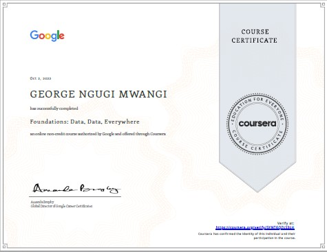
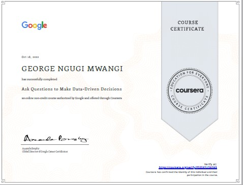

## About me

Hello there! This is George, a passionate scholar of statistics and data analytics. George aspires great things in life, enjoys utilizing data to solve issues in the real world, and finds enthusiasm in lifelong learning, teamwork, and excellence in all endeavors.

George has a Bachelor of Science degree in Economics and Statistics from Kenyatta University. He learned valuable skills in this undergraduate program, including how to conduct statistical analysis and describe how people, businesses, and governments behave economically. George is now seeking further data science and analytics education through the Coursera and DataCamp platforms. He aspires to become a proficient data professional using tools like the R and SQL programming languages, Power Bi and Tableau viz tools, and Markdown reporting.

## Skills

1. **Data Cleaning and Manipulation:** Tidyverse Framework | Microsoft Power Query | Pivot Tables

2. **Parametric Analysis and Hypothesis Testing with R**

3. **Sampling Techniques:** Probability Sampling in R

4. **Data Visualization:** Excel | Ggplot2 | Microsoft Power BI

5. **Text Analysis with tidytext package in R**

5. **SQL:** Data Manipulation Language

6. **Collaborating:** GitHub

7. **Reporting:** R Markdown

## Projects

#### [Analysing Sales Product and Sales Data](content/products_trends_report.html)
* The aim of this project is to analyze the sales data of REC Corp LTD. and provide valuable insights into their business. Our analysis will help the company make informed decisions about their products and improve their overall performance.

#### [Naive Bayes Classification of Customer Purchasing Behavior](content/naive_bayes.html)
* In this project, the aim is to predict whether a customer will purchase an iPhone or not using the customer's demographic information such as gender, age, and salary as input variables. The project was implemented using the Naive Bayes classifier in the R programming environment.

#### [K-Nearest Neighbor Classification of Iris Species](content/KNN_with_iris.html)
* In this project, the aim was to implement the K-Nearest Neighbor (KNN) classifier to classify iris species based on their sepal length, sepal width, petal length, and petal width. The iris dataset was used as the source of the data for the project.

#### [Analyzing World Population Data](content/script.html)
* This ongoing project looks at population increase in Kenya and other parts of the world between 1960 and 2020. The research also looks into how different income groups impact a country's population and regional trends in population increase.

#### [HR Employee Analytics and Behavior Prediction](content/Project_Report.html)
* As part of this project, I performed exploratory data analysis on employee data and created a logistic regression model to forecast whether or not an employee would quit the organization using key variables derived from EDA. The model revealed that if the company increased employee satisfaction level by one unit, the probability of an employee leaving reduced by 58.56 percent.

#### [Analyzing the gapminder dataset with SQL](content/working-with-the-gapminder-dataset.html)
* I used sequel to analyze the gapminder dataset from the `gapmider` library for this project. The SQL data manipulation language allowed me to practice data retrieval, aggregation, and analysis.

## Sample Data Analysis Reports

* **[EDA Report of the Gapminder Dataset](content/gapminder_EDA_report3.html)**
* **[Data Profiling Report of the Gapminder Dataset](content/gapminder_EDA_report2.html)**
* **[Time Series and forecasting](content/modeltime_intro_mattDancho.html)**
* **[Forecasting App](content/forecast_plots.html/index.html)**
* **[Time Series Plots](content/selected_10_ts.html/index.html)**
* **[Initial Visualization](content/initial_viz/index.html)**

## Resume

Download [here](content/Resume_George.pdf)

## Certifications

## My Values
George firmly believes in and advocates for integrity, hard work, and transparency in all facets of life.

# Contact Me
[Twitter](https://twitter.com/mwangi__george) [LinkedIn](https://www.linkedin.com/in/georgemwangikenya)    [Github](https://github.com/mwangi-george)

*“Anyone who stops learning is old, whether at twenty or eighty. Anyone who keeps learning stays young.” ― Henry Ford.*
